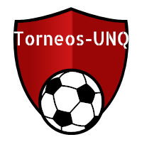

# TorneosUNQ 

 

El objetivo de la aplicación es agilizar la administración de los torneos internos que realiza la Universidad de Quilmes.

La solución apunta a brindar funcionalidades y herramientas para el manejo del torneo e información útil para todos los que participen del mismo o les interese saber sobre el torneo.
